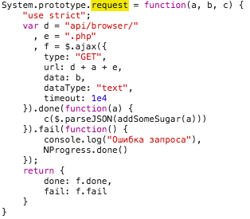

# Занятие 24.01.17

- Выяснили, из чего состоит HTTP-запрос
- Нашли данные на странице
- Поработали с HTTP-реквестилкой Postman
- Испытали боль от асинхронности в цикле: [async.js]()
- Написали скрепер для navi.kazantransport.ru

## HTTP

HTTP — протокол доступа к **ресурсам**. Примеры ресурсов:
- Профиль пользователя
- Корзина в интернет-магазине
- Список комментариев к посту
- Комментарий к посту

По HTTP у каждого ресурса должен быть уникальный идентификатор (**URI** или **URL**, разница
слишком тонкая и неважная) — место, в котором его можно найти:
- Профиль: http://stackoverflow.com/users/5903989/simon
- Список комментариев: https://www.reddit.com/r/reactjs/comments/4yjxgx/using_vuex_with_mobx/
- Один комментарий: https://www.reddit.com/r/reactjs/comments/4yjxgx/using_vuex_with_mobx/d6omwzc/

Также у запроса есть **метод** — действие, которое мы хотим совершить над ресурсом.
Для комментария с заголовком и текстом:
- `GET`: получить комментарий
- `POST`: создать новый комментарий. Поскольку самого ресурса еще нет, запрашиваем родительский, в данном случае — список комментариев.
- `DELETE`: удалить комментарий.
- `PUT`: Заменить комментарий. Отправить нужно новую версию целиком: заголовок и текст.
- `PATCH`: Обновить комментарий. Отправить нужно только отличие от текущей версии (patch = заплатка)

Метаданные о запросе — **заголовки** вида `<ключ>: <значение>`. Обычно нужны не для самого запроса, а для сервера. Например, запрос с заголовком `Accept: application/json` просит данные в JSON, а `Accept: application/xml` — в XML.

У запросов `POST`, `PUT`, `PATCH`, `DELETE` может быть **тело** — любые данные. Например,
в теле `PUT <комментарий>` будут текст комментария и заголовок.
В GET-запросах тела нет, так что параметры записывают в URL.

Воспроизвести запрос = запросить тот же URL тем же методом с теми же заголовками и телом — никакой магии (кроме куков).

## Кейс

### 1. Найти данные глазами

Простой эксперимент: выбираем в списке маршрут — он появляется на карте. Если он появился, то откуда-то должны были появиться данные.


### 2. Найти, откуда взялись данные
Открываем консоль браузера, смотрим, уходят ли какие-нибудь запросы при повторении эксперимента 1. Можно оставить только XHR. Уходит запрос к `getRoute` — похоже на то, что нужно, но возвращает какой-то мусор; пока проигнорируем это как необычную ситуацию. Параметр `mr_id` — id маршрута.

Если бы запроса не было, значит, данные уже были. Возможно,
- они подгрузились таким же запросом заранее — изучите все запросы, поищите похожий URL;
- они лежат в HTML — посмотрите исходный код страницы, поищите название какой-нибудь остановки;
- они спрятаны в исходниках — посмотрите скрипты.

### 3. Воспроизвести запрос без браузера

Используем postman — отличный HTTP-клиент. Делаем GET-запрос — получаем `null`.


В HTTP-запросе хрома есть заголовки, вероятно, сервер отказывает всем запросам без какого-то из них. Перетаскиваем заголовки из браузера (запрос, который сработал) в постман (в котором запрос не работает), выясняем, что нужен `Referer` (защита от CSRF-атак).


### 4. Воспроизвести запрос программно

```js
const request = require('request');
const fs = require('fs');
const path = require('path');

const scrape = () => {
  const url = 'http://navi.kazantransport.ru/api/browser/getRoute.php?mr_id=27';
  request({
    url,
    headers: {
      'Referer': 'http://navi.kaztransport.ru/main.php',
    },
  }, (err, res, body) => {
    fs.writeFileSync(path.join(__dirname, '27.json'), body);
  });
};

scrape();
```
Получается null :-( Дело в том, что postman сохранил кук от прошлых запросов —
кук выдается после любого запроса и используется в следующем. Никаких проблем,
у request есть для этого специальная опция, `jar` (cookie jar = банка с печеньками).
Заводим сессию первым запросом, затем собираем данные.
```js
...

request({
  url: 'http://navi.kazantransport.ru',
  jar: true,
}, () => scrape());
```

### 5. Составить список URL с данными

URL данных о маршруте id — `http://navi.kazantransport.ru/api/browser/getRoute.php?mr_id=<id>`.
Список id спрятан в HTML-коде селекта маршрутов на странице.
Сложить id в массив и делать из них URL очень просто:
```js
const scrape = (id) => {
  const url = `http://navi.kazantransport.ru/api/browser/getRoute.php?mr_id=${id}`;
  ... то же ...
}
scrape(27);
```

### 6. Обойти все адреса, сохранить данные.

**Внимание!** Если пройтись циклом по массиву id и запросить все страницы, то скорее всего сайт или упадет, или забанит вас (rate limiting). В любом случае, тут тонкая грань между сбором данных и DOS-атакой, и это некрасиво. Правильно делать запросы по очереди, и лучше выжидать несколько секунд между ними.
```js
const scrape = (id, cb) => {
  // теперь принимаем функцию cb ...
  const url = `http://navi.kazantransport.ru/api/browser/getRoute.php?mr_id=${id}`;
  request({
    url,
    headers: {
      'Referer': 'http://navi.kaztransport.ru/main.php',
    },
  }, (err, res, body) => {
    fs.writeFileSync(path.join(__dirname, `${id}.json`), body);
    // ... и вызываем ее, когда закончили:
    cb();
  });
};

const IDS = [ ... ];

// Рекурсивная обертка для scrape:
const process = (i) => {
  // База: закончить, когда обошли все элементы.
  if (i >= IDS.length) {
    return;
  }
  // Подождать 10 секунд и перейти к следующему id
  const next = () => {
    setTimeout(() => next(i + i), 10000);
  };
  // Пуск!
  scrape(IDS[i], next);
  // Если использовать вместо явного индекса IDS.pop(), то будет симпатичнее.
}

request({
  url: 'http://navi.kazantransport.ru',
  jar: true,
}, () => process(0));
```

### Проблема: данные в ответе закодированы

На шаге 2 мы отложили проблему: вместо данных запросы возвращают какой-то мусор.
Отличный повод реверс-инженернуть код сайта — если мусор превратился в карту, то
это произошло где-то в скрипте со страницы. Скрипты показаны в специальной вкладке
консоли браузера. К счастью, он всего один (`vendor` — стандартное назввание для
папки с библиотеками).


Код обфрусцирован (минифицирован) — из него убрали все пробелы, названия
переменных укоротили и сделали еще пару вещей, чтобы он занимал меньше места.
Штука с фигурными скобками в левом нижнем углу делает нормальное форматирование.

Остается найти преобразование, которое применяется к мусору:

1. Запрос идет к URL `getRoute`, поищем такой:

2. Метод `request` возвращает объект — значит, преобразование там
3. Из этого только `addSomeSugar` выглядит подозрительно

4. Тадам! Хватаем функцию, перетаскиваем к себе.


### Пара советов

**Индикатор активности.** Чтобы не думать, что скрепер завис, стоит на каждой
итерации писать что-нибудь в консоль — например, количество обработанных страниц.

**Отказоустойчивость.** Рано или поздно в ответе может прийти что-нибудь неожиданное
(например, в список попал лишний URL, или сервер неправильно обрабатывает один из маршрутов,
или вы запрашивали данные слишком аггресивно и вас забанили). Это скорее актуально для
скрепов покрупнее, но вот:
1. Вынести обработку данных в отдельный скрипт и запускать его отдельно от самого скрепера:
меньше работы — меньше шансов ошибиться. Например, в нашем примере стоит не запускать декодер,
а просто записать в файл закодированные данные. К тому же не окажется, что вы случайно
выкинули важную часть данных и все нужно начинать заново.
2. Сохранять данные с каждой страницы. Оптимизировать обращения к диску и писать
ответы в массив, а файл создать в самом конце кажется очень умным, пока все ваши
данные за 8 часов не исчезнут из-за одного плохого ответа. Конечно, после
перезапуска не нужно опять запрашивать старые страницы (хотя бы убрать их из списка руками).
3. Обернуть обработку в try/catch. Так URL, которые не получилось обработать, можно
куда-нибудь сложить и позже попробовать еще раз.
